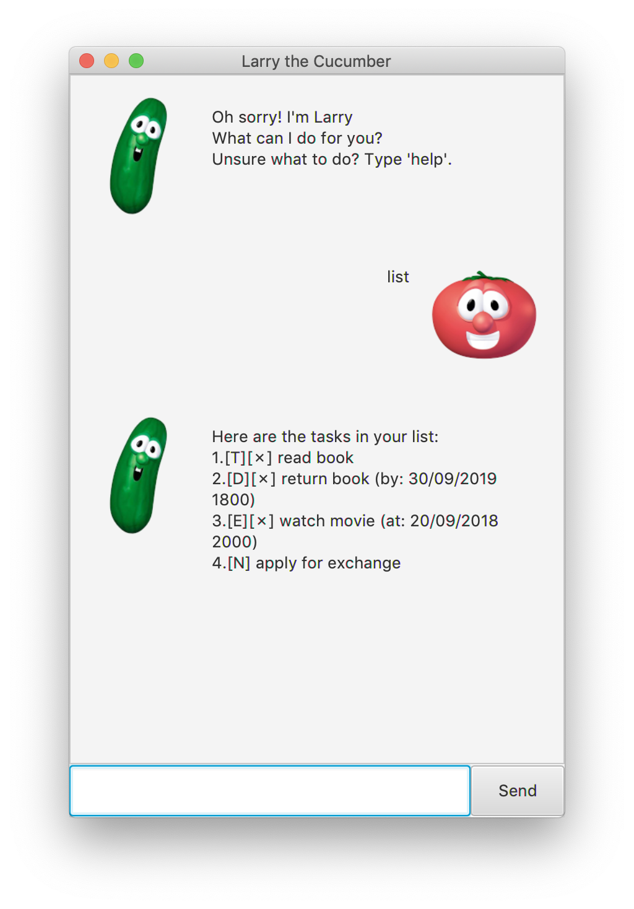

# User Guide

## Who is Larry the Cucumber?
Taken from the VeggieTales series of TV shows, Larry the Cucumber is a cucumber. He's one of the main protagonists of
the show and is Bob the Tomato's best friend. Together, they mostly serve as co-hosts, although they double up as actors
too.

Larry is best known for his witty series 'Silly songs with Larry' which has frequently been memed and circulated around
the internet.



## Features 

#### Help
Type help to receive in-application help tips at any time.

#### Todo
Allows you to record a to-do event.

#### Deadline
Allows you to set an task with a deadline.

#### Event
Allows you to create an event with a date and time.

#### Note
Allows you to store a note.

#### List
Lists all the tasks and notes currently stored.

#### Done
Marks a task as done.

#### Delete
Deletes a task or note.

## Usage

#### `help` - Lists all possible commands
Lists all possible commands with their syntax.

Example use: 

`help`

Expected outcome:

```
Here are the lists of commands available:  
list - displays a list of all available tasks.  
todo <description> - Adds a new todo.  
deadline <description> /by <dd/MM/yyyy HHmm> - Adds a new deadline.  
event <description> /at <dd/MM/yyyy HHmm> - Adds a new event.  
note <content> - Adds a new note.  
find <keyword> - finds an item by the keyword specified.  
done <number> - marks the entry with the corresponding number done.  
delete <number> - deletes the entry with the corresponding number.  
help - displays this help menu.
```

#### `list` - Lists all tasks
Lists all tasks currently stored.

Example use: 

`list`

Expected outcome:

```
Here are the tasks in your list:
1. [T][✗] read book
```

#### `todo <description>` - Adds a new todo
Adds a new todo task with `description` as its description.

Example use: 

`todo read book`

Expected outcome:

```
Got it. I've added this task:
[T][✗] read book
Now you have 1 task in the list.
```

#### `deadline <description> /by <dd/MM/yyyy HHmm> ` - Adds a new deadline.
Adds a new deadline task with `description` as its description, and the date/time as its deadline.

Example use: 

`deadline return book /by 30/09/2018 1800`

Expected outcome:

```
Got it. I've added this task:
[D][✗] return book (by: 30/09/2019 1800)
Now you have 2 tasks in the list.
```

#### `event <description> /at <dd/MM/yyyy HHmm> ` - Adds a new event.
Adds a new event task with `description` as its description, and the date/time as its time.

Example use: 

`event party /at 30/09/2018 1800`

Expected outcome:

`Got it. I've added this task:`
`[E][✗] party (at: 30/09/2019 1800)`
`Now you have 3 tasks in the list.`

#### `note <content>` - Adds a new note.
Adds a new short note with `description` as its content.

Example use: 

`note see a doctor`

Expected outcome:

```
Got it. I've added this task:
[N] see a doctor
Now you have 4 tasks in the list.
```

#### `done <number>` - Marks item as done
Marks with the item with the corresponding number as done.

Example use: 

`done 1`

Expected outcome:

```
Nice! I've marked this task asdone:
[T][✓] read book
```

#### `delete <number>` - Deletes an item
Deletes the item with the corresponding number.

Example use: 

`delete 1`

Expected outcome:

```
Noted. I've removed this task:
[T][✓] read book
```

#### `find <keyword>` - Finds an item
Finds all items matching the given keyword.

Example use: 

`find book`

Expected outcome:

```
Here are the matching tasks in your list:
1. [D][✗] return book (by: 30/09/2019 1800)
```


